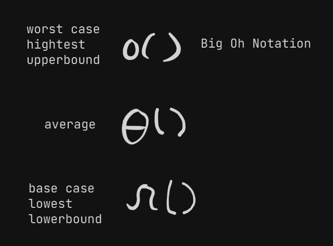

time complexity(tc)

tc != time taken

rate at which time taken increase with respect to input is tc

space complexity(sc)

memory space a program takes: auxilary spacce + input space
auxilary space - space takes to solve a problem
input space - space takes to store the problem

